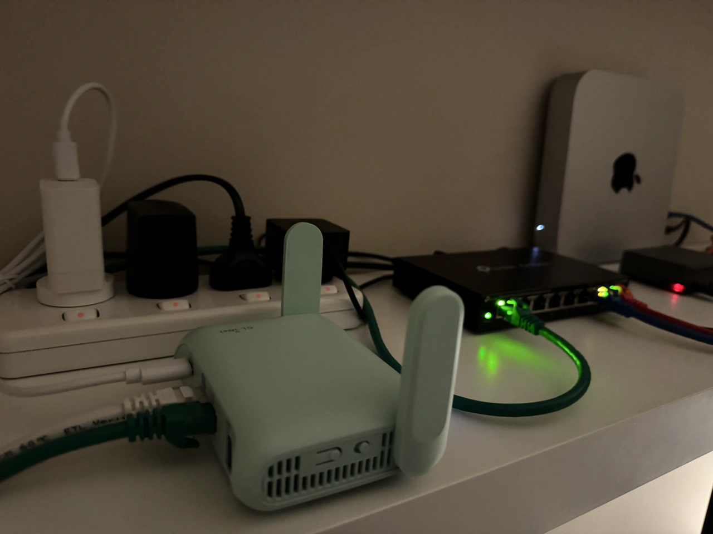
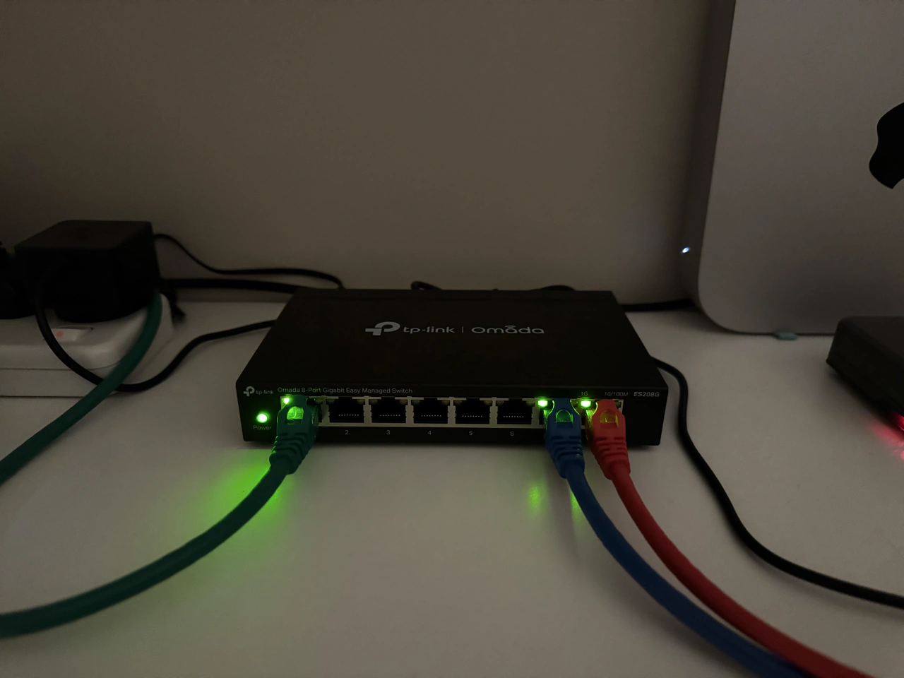
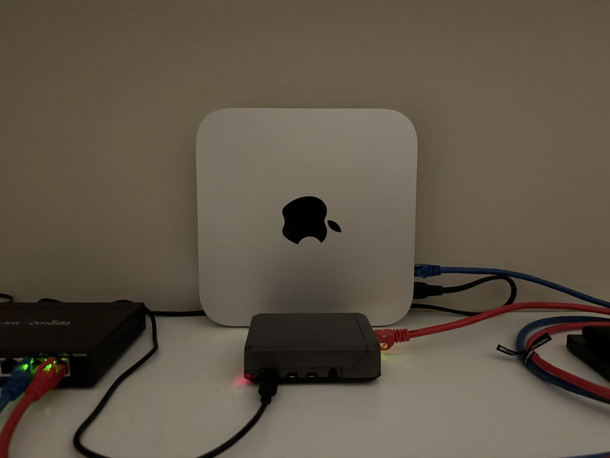
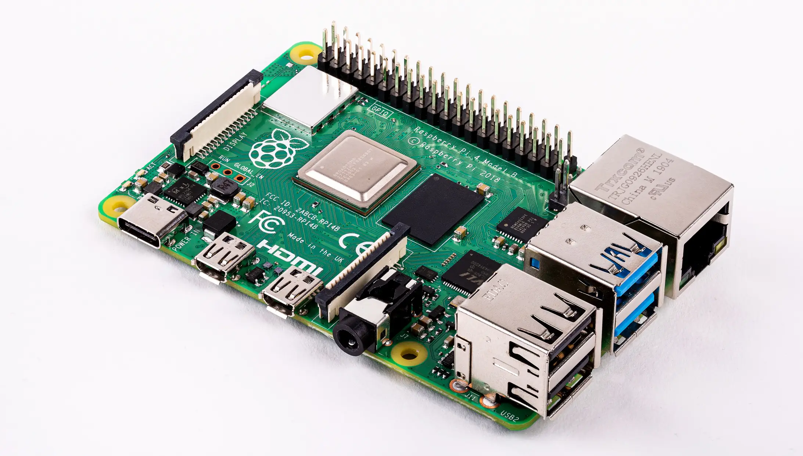

## Motivation

What is a lab anyway? It's a place where you do experiments of course! And that's exactly what I plan to do with my homelab — treat it as my own space to experiment with all the cybersecurity and networking concepts I come across.

The homelab is limitless, and I hope that as my knowledge, skill, and familiarity with the IT world increase, my homelab will get more advanced, deeper, and more interesting at the same time.

## The hardware

The foundation of any homelab is the gear itself. Though more advanced gear will allow for more advanced projects, I believe that you really don't need much to do much. With the small, humble homelab that I have at the moment, there is more opportunity to learn and practice than I could ever exhaust. 

With virtual machines nowadays, having only 2 or 3 computers, a router, and a managed switch, enables many opportunities to practice network segmentation, hardening, detection engineering and analysis, penetration testing, firewall rules and ACLs, IDS/IPS implementations, various OS configurations, enumeration and exploitation techniques, and network traffic capture and analysis — just to name a few ideas off the top of my head. This list is endless, and this is all doable in a basic little homelab, I just find that so cool!

So here is the current state of my homelab:

### Router

**GL.iNet Beryl 7**

The router is literally the gateway from the local network to the rest of the world. So it's pretty important to have if you want access to the internet. I am not the only person living in my home, so I wanted a way to isolate my homelab experiments away from the shared network I'm otherwise in. Since the stock router that came with my ISP does not have certain customisable features such as VLAN segmentation, I decided to get a 2nd router that will allow me to have a separate network, while still having internet access.

After some research I decided do go with the Beryl 7 router from GL.iNet. I chose this router because, while being a compact 'travel router', it actually had a lot of capabilities and features which I can play around with to help me get better at configuring networks. It does feature all the standard features found in most routers like WAN, LAN subnetting, DHCP, DNS, etc., but this router also uses an open source Linux firmware called OpenWrt, which enables extensive custom network configuration via the command line, or via a separate web interface. Although I might not need to delve into this aspect right away, it does allow more learning opportunities, it also unlocks features like VLANs and ACLs at the router level if I'd want to do that.

Finally, the router was pretty new when I got it, hence it has Wi-Fi 7 (802.11be), and other updates compared to an older router, which is nice to have.

In my setup, this router is set in 'router mode', connected via Ethernet from its WAN port directly to a LAN port of the upstream main router (the router connected to the external network infrastructure). This way, my second router still achieves essentially the max speeds of my home, while still having its own NAT (network address translation) boundary, insulating my homelab network from the outer primary router network.

### Switch

**TP-Link ES208G**

I wanted to have a switch as a part of my homelab, as it allows my servers to all be connected together in a wired connection. It also allows for the implementation of (and experimentation with) physical VLAN segmentation along the 8 ports, which will be easier to play around with and more practical than the VLAN segmentation on the router.
I had to make sure I chose a managed switch so that it would support 802.1Q VLAN tagging, which was the functionality I wanted. With this, I can practice doing segmentation of devices on the network for security hardening, mitigation, and potentially even experimenting with VLAN hopping attacks later on when I get a bit more advanced.

### Main lab machine

**MacBook Air M2**

The laptop is the heart of my homelab, this device is where I spend most of my time compared to everything else, this device is where I am writing these very words. It is the main node on the network from which I will be accessing the servers and other interfaces of the devices on the network via ssh, remote desktop / VNC, or a web interface. It will also be my attack box when doing CTFs, or homelab reconnaissance and penetration testing experiments of other devices on my network.

I already had this laptop before going on this cybersecurity journey, but it works quite well as a little attack box. With UTM or VMware, I can spin up a Linux or Windows VM very easily. I've been mostly using UTM (a native MacOS hypervisor software) to run a Kali Linux image, allowing me to connect to TryHackMe servers via VPN for the CTFs and learning path rooms. As I continue to progress with these projects, I'll be using my attack box with Kali to do those penetration testing experiments I mentioned above.

### Main MacOS server

**Mac Mini M2 Pro**

This is my main server, a headless (no monitor) Mac Mini. Like the Macbook, I already had this computer, but again it will serve me well in this homelab, this time as a primary target machine for penetration testing, and as a defence focused detection machine. This has more ram than my Macbook, so it'll be better for running heavier operating systems like Windows 10 and 11 in a VM. I'll also run a Ubuntu server on the Mini as a Linux server target as well.

### Secondary Linux server

**Raspberry Pi 4B**

This flexible little computer will work as an accessory server where I might be able to set up some multi-node scenarios at a later time. In the meantime it serves as a dedicated Linux machine in the network.
The Raspberry Pi actually opens up many project opportunities too, I can use it as a DNS sinkhole content filter, or have it act as another log source for an open source SIEM running on the primary server — to name two examples.

## Operating systems and software

As I've already discussed somewhat, the operating systems and virtualisation hypervisor software is what really unlocks the hardware functionality, and the overall capability of the homelab network.

### Operating systems

**Linux distros (Kali, Ubuntu, Raspberry Pi OS), Windows, MacOS**

My impression when facing up to the cybersecurity world, is that to be competent as a security professional, you need to be familiar and comfortable with all common operating systems. By that I mean at least a Linux distro or two, Windows, and MacOS (on desktop); and IOS and Android (on mobile).

Fortunately, my homelab features the majority of these: the Macs have their native OS as MacOS, they can also virtualise Linux and Windows in a VM very easily. The Raspberry Pi will be a standalone Raspberry PI OS (Linux) server. I have an iPhone for IOS, and plan to get an Android device later too as a secondary mobile device (though I have had one in the past).

Having a variety of operating systems in the homelab will help me stay familiar with the different OS environments, and to be able to test each for their advantages and vulnerabilities.

:::note
Linux and MacOS are both Unix based operating systems, so their directory structure and command line interfaces are actually quite similar already, which is fortunate for the sake of familiarity!
:::

### Virtualization software

**UTM, VMware Fusion**

Without virtualisation I wouldn't be able to have access to such a diverse range of operating systems in my homelab, so VMs have really made this setup possible. VMs also provide a level of containment which is useful when experimenting on my network generally, if I make a mistake and wreck an OS installation while testing things, VMs make it seamless to spin up another instance either via a saved snapshot, or by a fast re-install from an ISO file. Later on, this containment factor will prove useful for malware analysis, allowing me to create a safe, contained environment for static or dynamic malware analysis.

As an example, with the hypervisor software (I use either UTM or VMware), I can use Kali Linux as a VM on my Macbook, this could be an attack box. On the Mini server, I can have Windows as a target machine or detection host. I can also use other useful Linux distros for various forensic or malware analysis tasks.

## Attack and defend lab environment

The first real test of the homelab working together will likely be implementing an attack and defence situation at the same time: an attack box VM on the Macbook, and a target machine VM on the Mac Mini.

The very first trial of this will be to set up a packet capture tool like Wireshark or tcpdump on the target machine, while at the same time actively scanning the target machine from the Kali VM. This I believe, will be a suitable simple first test of this kind of detection scenario, where I can begin to get some more hands-on experience within my own homelab setup, rather than just relying on TryHackMe's pre-configured VMs for practice.

## Final thoughts and future possibilities

So that is the state of the homelab so far. I'll definitely adapt and improve it as I learn more, but for now I am excited about the seemingly infinite possibilities and project ideas!

The next steps will be doing a couple of simple projects like network traffic analysis and active reconnaissance. I look forward to setting up some more tools on these systems and experimenting.