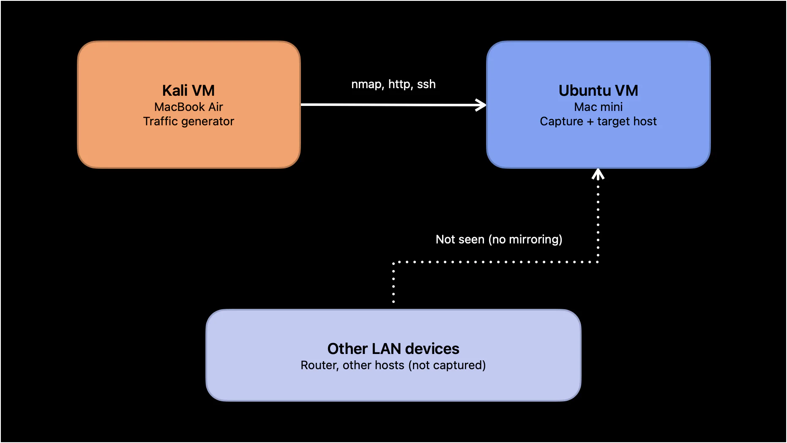

## The plan for this homelab

In this log entry I want to do a simple experiment with network traffic analysis, testing how one can capture data sent over a network with a tool like Wireshark, and how to can analyse and interpret the captured data packets.
In the subsequent logs on this topic, I plan to go deeper into the capture and analysis — capturing data from multiple sources including from indirect hosts on my network with port mirroring, and also analysing more types of network traffic. 

For this log entry however, I will go over a more fundamental and basic network traffic capture situation. I will use two machines on the network: a Kali Linux VM on my MacBook, and a Ubuntu VM on my Mac mini server. The Kali VM, will be generating the network traffic to be captured, the traffic will be directed at the Ubuntu VM. It will do a targeted active reconnaissance scan with Nmap, make a http connection, and attempt an ssh connection.
The Ubuntu VM will be the target server, the receiver of the network traffic. It will therefore be the system capturing the network traffic with Wireshark.

The setup I outlined can be seen in the network topology diagram above. Since this test will focus on generating directed network traffic (connections directed at the Ubuntu VM IP address), the data captured should mostly be coming from the Kali VM, and not other hosts on the network. To pickup traffic from other hosts, that traffic would either need to be some kind of broadcast traffic, or I'd need to set up monitoring on my switch with port mirroring. I will surely do this in one of the following logs, but for now I'll keep it simple until I cover something more rudimentary.

## Wireshark overview

## Generating traffic to capture

## Packet capture

## Analyzing the captured packets

## What I learned