## The plan for this homelab

In this homelab project, I want to do a simple experiment with network traffic analysis, testing how I can capture data sent over a network with a tool like Wireshark, and how to analyse and interpret the captured data packets and frames.
In the subsequent logs on this topic, I plan to go deeper into the capture and analysis — capturing data from multiple sources including from indirect hosts on my network with port mirroring, and also analysing more types of network traffic. 

For this log entry however, I will go over a more fundamental and basic network traffic capture situation. I will use two machines on the network: a Kali Linux VM on my MacBook, and a Ubuntu VM on my Mac mini server. The Kali VM, will be generating the network traffic to be captured, the traffic will be directed to the Ubuntu VM. 

Initially I will set up the VMs and network to get the capture between the hosts I want, and then to test the setup with a simple ping ICMP (internet control message protocol) capture. In the following log entries in this Wireshark fundamentals series, I will: do a targeted active reconnaissance scan with Nmap, make a http connection with an 'in the clear' file transfer, attempt an ssh connection, and finally, I will show a secure copy (scp) transfer, contrasting the unencrypted http traffic with the encrypted ssh / sftp traffic.

## Network topology

The Ubuntu VM will be the target server, the receiver of the network traffic. It will therefore be the system capturing the network traffic with Wireshark.


The setup I outlined can be seen in the network topology diagram above. Since this test will focus on generating directed unicast network traffic (connections directed to and from the Ubuntu VM IP address), the data captured should mostly be coming from the Kali VM, and not other hosts on the network. To pickup traffic from other hosts, that traffic would either need to be some kind of broadcast, anycast, or multicast traffic, or I'd need to set up monitoring on my switch with port mirroring. I will surely do this in one of the following logs, but for now I'll keep it simple until I cover something more rudimentary.

## The Kali and Ubuntu VMs

Before getting into any kind of Wireshark traffic capture, I need to make sure that both of these host VMs are set up and configured properly. For this homelab experiment, I used UTM as my virtual machine hypervisor software. In future homelabs I'll use other software like VMware, but for now I'm using UTM, I've found UTM simple to set up, and it also has the option to use either the QEMU or Apple virtualisation engine.

Setting up the VM with UTM could be covered in a separate write-up, but here I'll just say that I simply downloaded a Kali Linux and Ubuntu ISO image from their respective websites, and followed through with the setup to install a VM instance — Kali on the MacBook Air, Ubuntu on the Mac mini.

Now this is the important part of the VM setup for this lab: setting up and identifying the MAC and IP address situation of both of the VMs. Navigating to the UTM network settings, we can configure the network mode.

### Configuring the Ubuntu VM

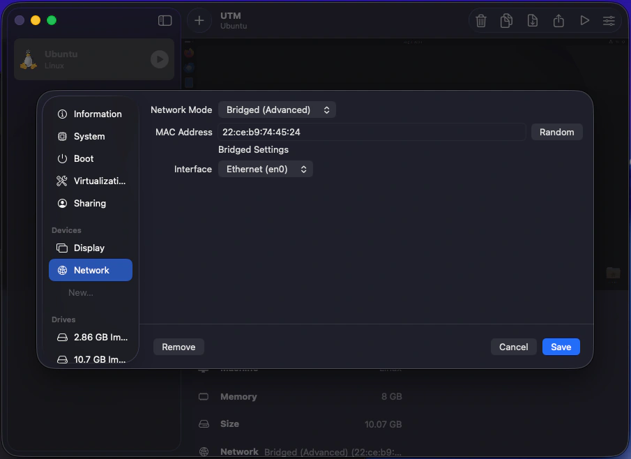

As can be seen here, on the Ubuntu VM I decided to set the network mode to bridged mode. Bridged mode passes through the VM to the rest of the network as its own host entity. This means that my router will recognise the Ubuntu VM as a separate host to the Mac mini host it lives within. The generated MAC address by UTM for the Ubuntu VM is also shown here, and this is the MAC address the router will use when assigning the VM host its own IP address on the network with DHCP.

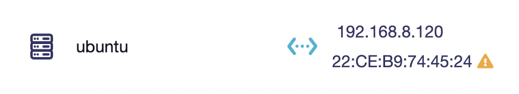

Here we can see the Ubuntu VM host as it appears on my router's client list (via the web interface). Note that the MAC address is the same as what was generated for the VM and not the MAC address of the Mac mini host itself, this is what I wanted, as it sets up the Ubuntu as a separate host. I've also set the IP address of the Ubuntu VM host via DHCP address reservation to: `192.168.8.120`. This will make it so the IP stays the same and doesn't periodically change, making it easier and more consistent as a target machine. This IP address is what will be targeted by the Kali VM, and will show up a lot in the rest of this write-up.

### Configuring the Kali VM

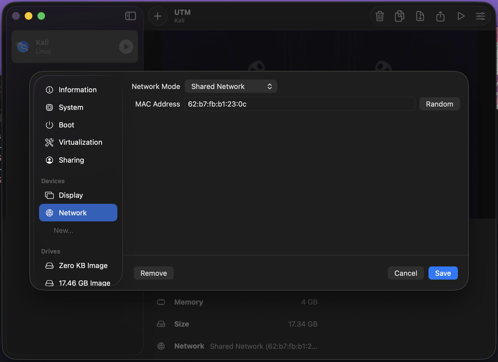

This is the same UTM network settings page, but now on the MacBook, and for the Kali VM.
For the Kali VM I have left it as the default shared network setting, while it would've been nice to have the Kali VM as its own separate host entity just like the Ubuntu VM has, the situation here is a little different. While the Mac mini (with Ubuntu VM) is connected to my switch via a wired Ethernet connection, the MacBook (with Kali VM) is connected to my router via a Wi-Fi connection. The wired connection can handle multiple MAC addresses originating from the same network interface, this is common on an Ethernet connection, but apparently multiple MAC addresses moving from the same Wi-Fi interface isn't supported, at least on my OS, and from what some brief research had shown.

This is fine however, the result is just that I'll be using the shared network mode. This essentially has the Kali VM adopt the same MAC address and IP address of the host machine (the MacBook).

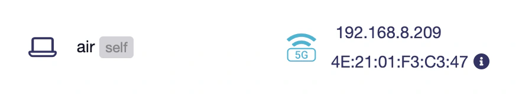

Here we can see the MacBook Air host as it appears on my router's client list. This is the same MAC address and IP address the Kali VM will be sharing. All traffic coming from and going to the Kali VM will be using these addresses. I haven't reserved this IP address, as it is a Wi-Fi connected portable device, and often leaves the network.

:::note
The MAC address shown here is a randomised MAC address, hence why I feel comfortable sharing it. Many modern operating systems have this privacy feature on by default for Wi-Fi connected network devices, as it prevents tracking and fingerprinting of your hardware MAC address across networks. Randomised locally administered addresses (LAA), can be identified by the second hexadecimal digit in the first octet, it will always be 2, 6, A, or E — as seen with mine.
:::

### VM host MAC and IP addresses

Now we have the addresses for each VM host which is great, this is important as it'll allow us to identify them in the Wireshark traffic capture.

```txt title=vm-addresses.txt
ubuntu vm
---------
IP: 192.168.8.120
MAC: 22:CE:B9:74:45:24

kali vm
-------
IP: 192.168.8.209
MAC: 4E:21:01:F3:C3:47
```

### VM desktops

Both VMs are now set, we can boot them up and start the capture scenarios.

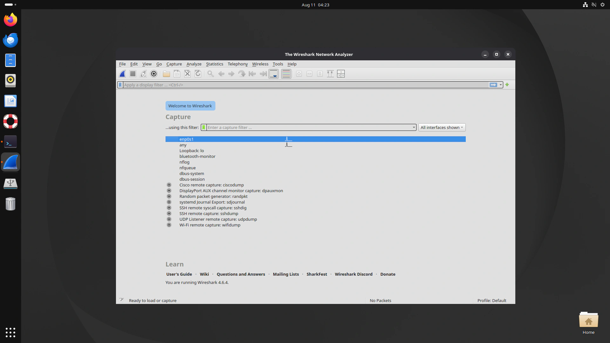

Here is what my Ubuntu VM desktop looks like with Wireshark installed and opened.

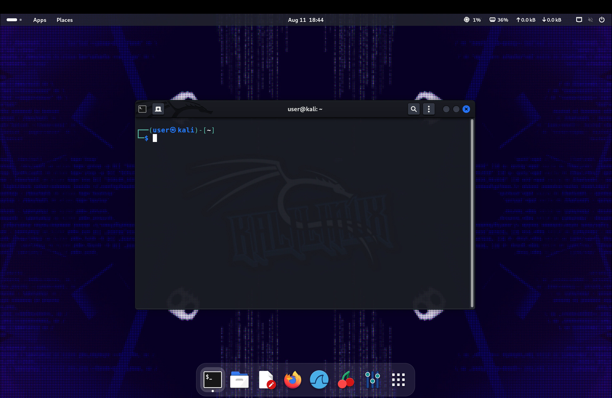

And here is what my Kali VM desktop looks like with the terminal opened.

## Wireshark overview

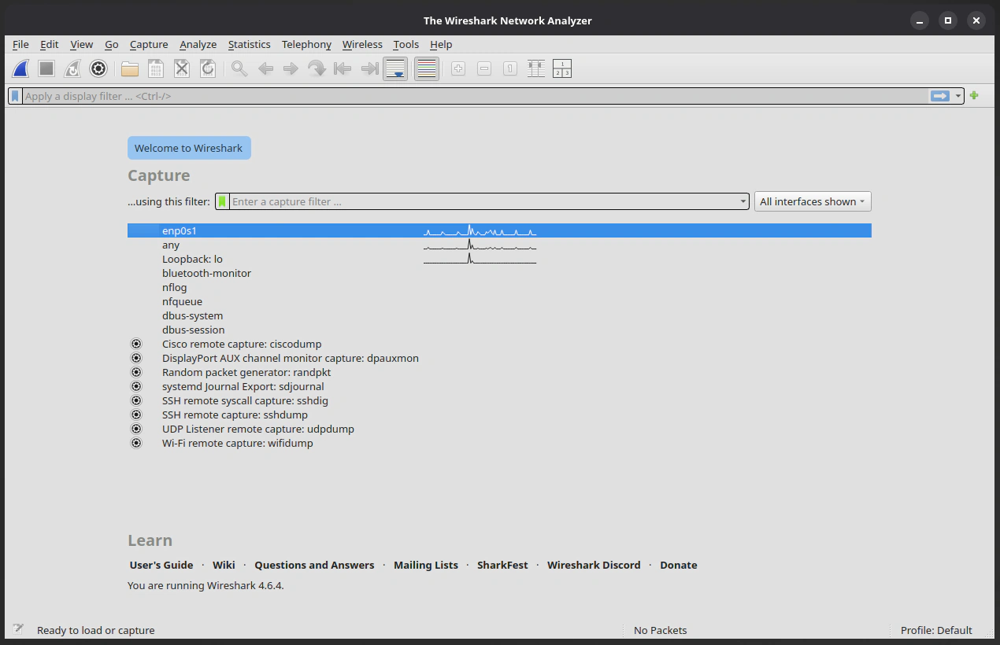

Looking a little closer here at Wireshark on Ubuntu, we can see the home panel with various options. In the centre there is the main capture section, here you can see a capture filter, and a list of available interfaces and presets.

The interface I'll be capturing from is: `enp0s1`. This is what Ubuntu is calling the Ethernet interface which is connecting the Mac mini to the switch. The filter section from the home capture page, can be useful for filtering out traffic from specified protocols, addresses, and more. Filtering before the capture makes it so the filtered traffic won't even be seen in the capture. The alternative is capturing everything and then filtering the capture once it's been captured. A combination of both can also be done. 

I experimented with both, but for the following results I decided to capture everything, look at what there is, and then filtering out after the capture. I actually recommend this for learning as you'll get to see some of the network chatter that is happening on your network (which I found insightful).

To do a capture you can either: select the interface and press the blue shark-fin button, you can simply double-click on the interface, or you can use the capture settings window by clicking the cog button. This allows for various settings like setting promiscuous mode for each interface, and scanning from multiple interfaces. 

Promiscuous mode tells the network interface card (NIC) of the computer to accept all network packets available to it into the capture, even if those packets aren't addressed to the host doing the capture.
From my understanding however, this won't pick up unicast traffic between other hosts, only multicast or broadcast traffic, and the unicast traffic directed to or from the capture host itself.

:::note
For capturing other unicast traffic on the network (from one host to another, but not the capture host), another network monitoring solution is first needed to be implemented, such as port mirroring / SPAN on a switch, or a network tap.
:::


## Testing packet capture with ping

So now I am ready to start capturing some traffic. One of the simplest ways to test the setup is to ping the Ubuntu VM from the Kali VM. So that's exactly what I will do.

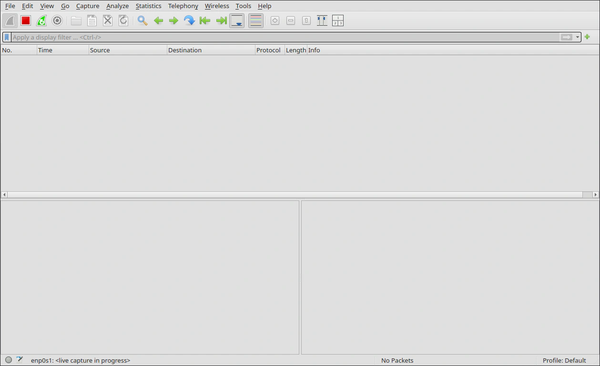

Here on Ubuntu, I have started a capture on the `enp0s1` interface. While this is capturing live, I'll switch over to Kali and ping Ubuntu.

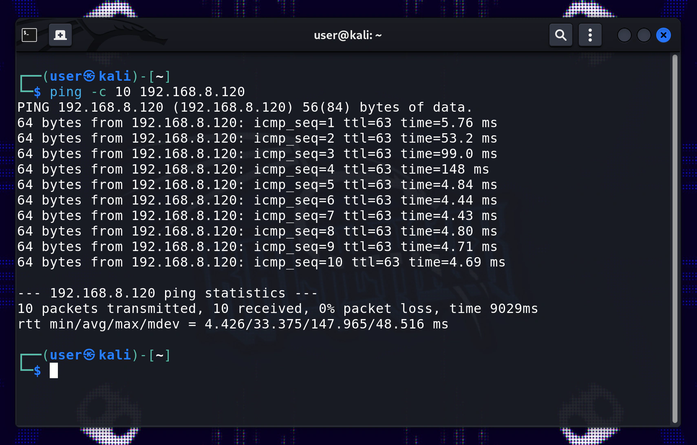

As seen in this screenshot I have used ping to send ICMP packets to Ubuntu with this command:

```
ping -c 10 192.168.8.120

# [-c 10] sets count to 10 (10 ICMP ping requests)
```

## Packet capture analysis

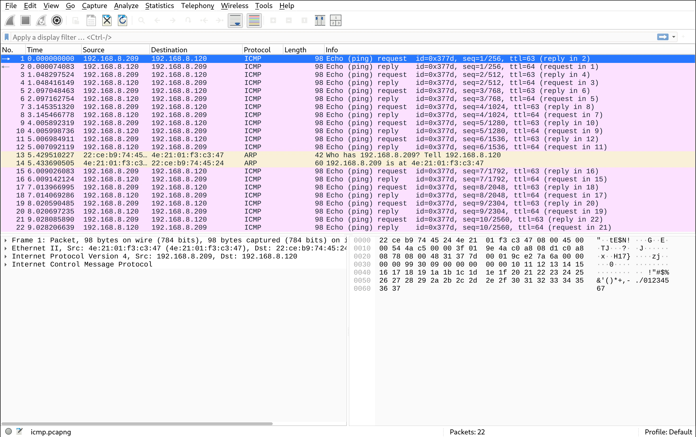

Back in Wireshark we can see some packets coming in, nice! 

This will be a good time to mention the capture screen setup on Wireshark. This screenshot was taken after I ended the capture (with the stop button), applied some filters (to remove some of my home network noise), and exported the filtered capture into a pcapng file (by going to file > export specified packets).

To filter for the traffic shown in this screenshot, you can simply put `icmp or arp` into the filter bar and hit enter. But my filtering for these captures, was specifically done to remove noise from my network, filtering out packets that would unnecessarily expose hardware MAC addresses of some of my devices, and also crowding the packet list. This included noise from other protocols like NTP, ARP (communicating with other hosts), mDNS, and others.

To achieve my goal, I used a negation filter that made it so the capture didn't display traffic from certain addresses. I used a filter like this: `!(eth.addr == xx:xx:xx:xx:xx:xx) && !(eth.addr == xx:xx:xx:xx:xx:xx)` for however many addresses that needed blocking. You can remove the `!` to have the opposite effect if you want to only display packets from certain addresses explicitly. You can also use `ip.addr != x.x.x.x` or `ip.addr == x.x.x.x` for the same deny / allow effect with IP addresses. There are a lot of different ways to filter many variables as you can certainly see.

Now lets look at the main capture view of Wireshark, there are three panels: the packet list panel, the packet details panel, and the packet bytes panel. 

## The packet list panel

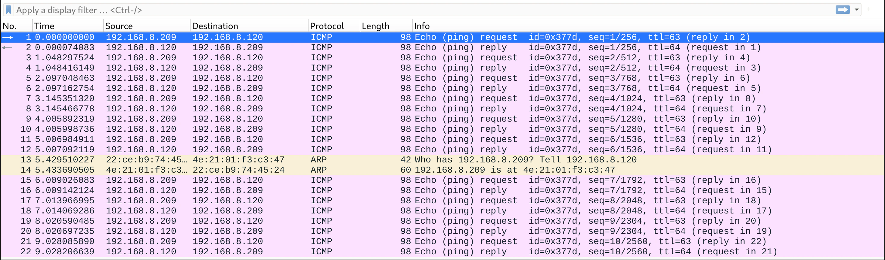

The top panel is the packet list, it displays all the packets from the capture — this is the list that we were just filtering. Here we can see an overview of the most relevant information of each packet at a glance: the packets numbered sequentially from the capture start; the time elapsed in seconds since the capture started; the source and destination IP / MAC address of the packet; the protocol; the length of the packet in bytes; and an additional information section differing based on protocol.

In the screenshot above, lets look at our ping capture. We can see 22 packets in total, 20 of which are ICMP packets. This makes sense since we just did a ping scan with a count of 10, this has resulted in 10 ping requests from `192.168.8.209 (Kali VM)` to `192.168.8.120 (Ubuntu VM)`, and 10 ping replies in the opposite direction.

Another interesting thing to note here is that there are 2 ARP packets that turned up in this scan as well. Since ARP works at layer 2 (Ethernet / data link layer), the MAC addresses are displayed, as those packets don't have IP addresses or other header information from higher network layer protocols. Checking those MAC addresses we can note that they belong to the Ubuntu and Kali VMs. The first ARP packet is from `22:ce:b9:74:45:24 (Ubuntu VM)`, it asks `4E:21:01:F3:C3:47 (Kali VM)` who has `192.168.8.209 (Kali VM)`? Tell `192.168.8.120 (Ubuntu VM)`. This is basically Ubuntu asking Kali who has Kali's IP? The 2nd ARP packet is the expected reply from Kali to Ubuntu, saying that it has that IP address.

This is an ARP (address resolution protocol) table update, it is the system that happens at layer 2 to make sure hosts can communicate with each other using MAC addresses matched to the correct IP addresses. This also happened right before the ICMP messages started flowing, but between my router and these hosts — however those are filtered out from my capture.

## The packet details and bytes panels

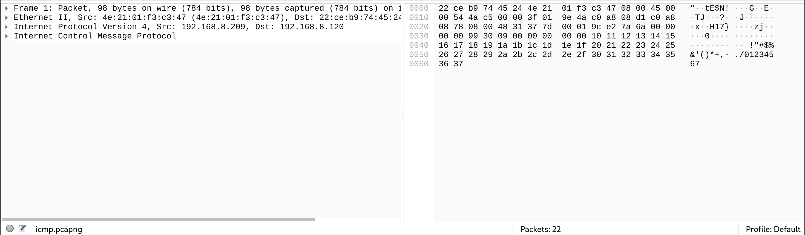

The bottom left panel is the packet details panel. This contains the details of all the data found within the packets themselves, in a structured and readable way. Wireshark parses the raw Ethernet frame data into all the protocol headers and the payload contained within.

The bottom right panel is the packet bytes panel. This contains the raw byte data represented in both hexadecimal and ascii formats. When clicking on the headers and payloads in the details panel, the corresponding bytes are highlighted in the packet bytes panel. Similarly, when clicking on packets in the packet list panel, the details of those packets are displayed in the packet details panel.

Now I'll briefly go over some of the details found in the packet details panel for packet 1.

## Analysis of an ICMP packet

### Frame 1: Packet — metadata

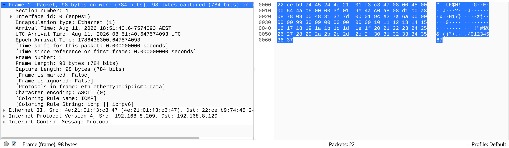

Since the packet selected is packet 1 (the first ICMP packet), there will naturally only be the headers and payload data found within a ICMP packet, (a TCP packet will have some different headers and a different payload for instance).
An ICMP packet will have: An Ethernet frame (header and tail), an IPv4 header, and an ICMP header and payload.

The first section in the details panel (expanded in the screenshot above), is actually an additional meta section provided by Wireshark — Frame 1: Packet. This section provides capture metadata about the selected packet, metadata like: the total bytes, interface id, capture timestamps, protocols, etc.

When this section is selected, the entire packet / frame is highlighted on the packet byte panel.

### Ethernet II — header

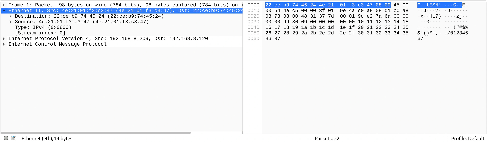

This section — Ethernet II — is where the actual packet / frame data begins. Here we can see the Ethernet frame data selected. An Ethernet frame on the wire actually first has 7 bytes of a preamble (alternating 10101010 — for clock synchronisation), and 1 byte for a start frame delimiter (SFD, signals frame start, 10101011), in the header right before what is shown here in Wireshark. It also has a tail of 4 bytes with a frame check sequence (CRC). The NIC usually strips these additional parts of the Ethernet frame as it enters the interface, and everything else is what we see here in Wireshark.

Other than the additional preamble and SFD, the Ethernet frame begins with the destination MAC address, followed by the source MAC address, and then the Ethernet type. Looking at the highlighted Ethernet frame in the packet byte panel, we can recognise the destination Ubuntu VM MAC address as the first 6 bytes: `22 ce b9 74 45 24`, followed by the source Kali VM MAC address in the next 6 bytes: `4e 21 01 f3 c3 47`, and finally the type (IPv4) in the last 2 bytes: `08 00`.

### Internet Protocol Version 4 — header

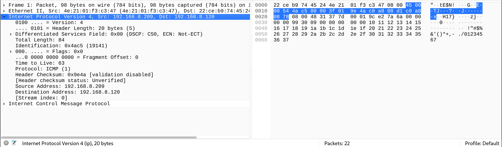

This section — Internet Protocol Version 4 — contains the IP header information. The IP header contains information such as: version, length, flags, time to live (TTL), protocol, and the source and destination IP addresses themselves. If you were to select these values, the corresponding bytes in the packet bytes panel would be highlighted. For instance, if we were to select the source IP address value, the 4 bytes containing the source IP address would be highlighted.

### Internet Control Message Protocol — header and payload

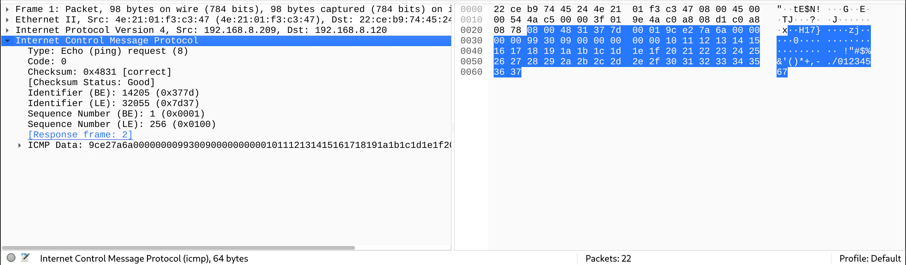

And lastly, this section — Internet Control Message Protocol — contains the ICMP header information, as well as the ICMP payload data. The ICMP header is pretty minimal, it contains values such as: a type (8 for ping request 0 for ping reply), a code for errors, a checksum, and identifiers. The ICMP data payload is also quite minimal, it contains: a timestamp, and some arbitrary data (notice the sequential bytes: 10, 11, 12, 13...). The arbitrary data is a filler, which is used, so the packet reaches a certain size.

## What I've learnt and what's to come

So far in this log entry we've covered:

- An overview of the plan for this homelab project
- The network topology
- VM set up and configuration
- An overview of the Wireshark pre-capture panel
- Testing packet capture with ICMP ping requests
- An overview of the Wireshark post-capture panels
- Broad packet analysis of the packet list
- Analysis of an ICMP packet in more detail

This was a nice experience for me to get some good hands on practice with the fundamental network and system dynamics involved in generating, capturing, and analysing network traffic. Although this example was simple, and only analysed ICMP ping requests, these skills will apply to more complex and advanced captures.

In the next log entries in this series, I will use a similar setup to capture and analyse: 

- Nmap reconnaissance port scans
- http unencrypted TCP traffic
- ssh encrypted communication
- scp / sftp encrypted traffic

And more advanced network capture and analysis with Wireshark, tshark, and tcpdump, in future projects.

That wraps up my packet capture and analysis fundamentals log entry. Next up I'll be running an Nmap scan against the Ubuntu VM, and capturing what that reconnaissance traffic actually looks like on the wire — thanks for reading, hope to see you in the next one!
