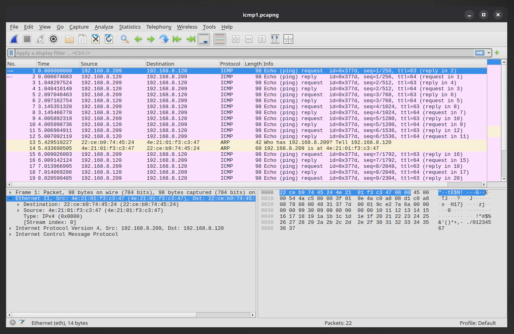

## The plan for this homelab

In this homelab project, I want to do a simple experiment with network traffic analysis, testing how I can capture data sent over a network with a tool like Wireshark, and how to can analyse and interpret the captured data packets and frames.
In the subsequent logs on this topic, I plan to go deeper into the capture and analysis — capturing data from multiple sources including from indirect hosts on my network with port mirroring, and also analysing more types of network traffic. 

For this log entry however, I will go over a more fundamental and basic network traffic capture situation. I will use two machines on the network: a Kali Linux VM on my MacBook, and a Ubuntu VM on my Mac mini server. The Kali VM, will be generating the network traffic to be captured, the traffic will be directed at the Ubuntu VM. 

Initially I will set up the VMs and network to get the capture between the hosts I want, and then to test the setup with a simple ping ICMP (internet control message protocol) capture. In the following log entries in this Wireshark fundamentals series, I will: do a targeted active reconnaissance scan with Nmap, make a http connection with an 'in the clear' file transfer, attempt an ssh connection, and finally, I will show a secure copy (scp) transfer, contrasting the unencrypted http traffic with the encrypted ssh / sftp traffic.

The Ubuntu VM will be the target server, the receiver of the network traffic. It will therefore be the system capturing the network traffic with Wireshark.


The setup I outlined can be seen in the network topology diagram above. Since this test will focus on generating directed network traffic (connections directed to and from the Ubuntu VM IP address), the data captured should mostly be coming from the Kali VM, and not other hosts on the network. To pickup traffic from other hosts, that traffic would either need to be some kind of broadcast traffic, or I'd need to set up monitoring on my switch with port mirroring. I will surely do this in one of the following logs, but for now I'll keep it simple until I cover something more rudimentary.

## The Kali and Ubuntu VMs

Before getting into any kind of Wireshark traffic capture, I need to make sure that both of these host VMs are set up and configured properly. For this homelab experiment, I used UTM as my virtual machine hypervisor software. In future homelabs I'll use other software like VMware, but for now I'm using UTM, I've found UTM simple to set up, and it also has the option to use either the QEMU or Apple virtualisation engine.

Setting up the VM with UTM could be covered in a separate write-up, but here I'll just say that I simply downloaded a Kali Linux and Ubuntu ISO image from their respective websites, and followed through with the setup to install a VM instance — Kali on MacBook Air, Ubuntu on the Mac mini.

Now this is the important part of the VM setup for this lab: setting up and identifying the MAC and IP address situation of both of the VMs. Navigating to the UTM network settings, we can configure the network mode.


As can be seen here, on the Ubuntu VM I decided to set the network mode to bridged mode. Bridged mode passes through the VM to the rest of the network as its own host entity. This means that my router will recognise the Ubuntu VM as a separate host to the Mac mini host it lives within. The generated MAC address by UTM for the Ubuntu VM is also shown here, and this is the MAC address the router will use when assigning the VM host its own IP address on the network with DHCP.


Here we can see Ubuntu VM host as it appears on my router's client list (via the web interface). Note that the MAC address is the same as what was generated for the VM and not the MAC address of the Mac mini host itself, this is what I wanted, as it sets up the Ubuntu as a separate host. I've also set the IP address of the Ubuntu VM host via DHCP address reservation to: `192.168.8.120`. This will make it so the IP stays the same and doesn't periodically change, making it easier and more consistent as a target machine. This IP address is what will be targeted by the Kali VM, and will show up a lot in the rest of this write-up.


This is the same UTM network settings page, but now on the MacBook, and for the Kali VM.
For the Kali VM I have left it as the default shared network setting, while it would've been nice to have the Kali VM as its own separate host entity just like the Ubuntu VM has, the situation here is a little different. While the Mac mini (with Ubuntu VM) is connected to my switch via a wired Ethernet connection, the MacBook (with Kali VM) is connected to my router via a Wi-Fi connection. The wired connection can handle multiple MAC addresses originating from the same network interface, this is common on an Ethernet connection, but apparently multiple MAC addresses moving from the same Wi-Fi interface isn't supported, at least on my OS, and from what some brief research had shown.

This is fine however, the result is just that I'll be using the shared network mode. This essentially has the Kali VM adopt the same MAC address and IP address of the host machine (the MacBook).


Here we can see the MacBook Air host as it appears on my router's client list. This is the same MAC address and IP address the Kali VM will be sharing. All traffic coming from and going to the Kali VM will be using these addresses. I haven't reserved this IP address, as it is a Wi-Fi connected portable device, and often leaves the network.

:::note
The MAC address shown here is as randomised MAC address, hence why I feel comfortable sharing it. Many modern operating systems have this privacy feature on by default for Wi-Fi connected network devices, as it prevents tracking and fingerprinting of your hardware MAC address across networks. Randomised locally administered addresses (LAA), can be identified by the second hexadecimal digit in the first octet, it will always be 2, 6, A, or E — as seen with mine.
:::

Now we have the addresses for each VM host which is great, this is important as it'll allow us to identify them in the Wireshark traffic capture.

```txt
ubuntu vm
---------
IP: 192.168.8.120
MAC: 22:CE:B9:74:45:24

kali vm
-------
IP: 192.168.8.209
MAC: 4E:21:01:F3:C3:47
```

Both VMs are now set, we can boot them up and start the capture scenarios.


Here is what my Ubuntu VM desktop looks like with Wireshark installed and opened.


And here is what my Kali VM desktop looks like with the terminal opened.

## Wireshark overview


Looking a little closer here at Wireshark on Ubuntu, we can see the home panel with various options. In the centre there is the main capture section, here you can see a capture filter, and a list of available interfaces and presets.

The interface I'll be capturing from is: `enp0s1`. This is what Ubuntu is calling the Ethernet interface which is connecting the Mac mini to the switch. The filter section from the home capture page, can be useful for filtering out traffic from specified protocols, addresses, and more. Filtering before the capture makes it so the filtered traffic won't even be seen in the capture. The alternative is capturing everything and then filtering the capture once it's been captured. A combination of both can also be done. 

I experimented with both, but for the following results I decided to capture everything, look at what there is, and then filtering out after the capture. I actually recommend this for learning as you'll get to see some of the network chatter that is happening on your network (which I found insightful).

To do a capture you can either: select the interface and press the blue shark-fin button, you can simply double-click on the interface, or you can use the capture settings window by clicking the cog button. This allows for various settings like setting promiscuous mode for each interface, and scanning from multiple interfaces. 

Promiscuous mode tells the network interface card (NIC) of the computer to accept all network packets available to it into the capture, even if those packets aren't addressed to the host doing the capture.
From my understanding however, this won't pick up unicast traffic from one host to another, only multicast or broadcast traffic, and the unicast traffic directed to or from the capture host itself.

:::note
For capturing other unicast traffic on the network (from one host to another, but not the capture host), another network monitoring solution is first needed to be implemented, such as port mirroring / SPAN on a switch, or a network tap.
:::


## Testing packet capture with ping

So now I am ready to start capturing some traffic. One of the simplest ways to test the setup is to ping the Ubuntu VM from the Kali VM. So that's exactly what I will do.


Here on Ubuntu, I have started a capture on the `enp0s1` interface. While this is capturing live, I'll switch over to Kali and ping Ubuntu.


As seen in this screenshot I have used ping to send ICMP packets to Ubuntu with this command:

```
ping -c 10 192.168.8.120

# [-c 10] sets count to 10 (10 ICMP requests)
```



Back on Wireshark we can see some packets coming in, nice! 

This will be a good time go mention the capture screen setup on Wireshark. This screenshot was taken after I ended the capture (with the stop button), applied some filters (to remove some of my home network noise), and exported the filtered into a pcapng file (by going file > export specified packets).

To filter for this traffic shown, you can simply put `icmp or arp` into the filter bar and hit enter. But my filtering for these captures was specifically to remove noise from my network that would unnecessarily expose hardware MAC addresses of some of my devices and crowd the packet list, along with other noise from the other protocols like NTP, ARP (for other hosts), mDNS, and others. 

To achieve my goal I used a negation filter that made it so it didn't display traffic from certain addresses like this: `!(eth.addr == xx:xx:xx:xx:xx:xx) && !(eth.addr == xx:xx:xx:xx:xx:xx)` for however many addresses that needed blocking. You can remove the `!` to have the opposite effect if you want to only display packets from certain addresses explicitly. You can also use `ip.addr != x.x.x.x` or `ip.addr == x.x.x.x` for the same effect respectively for IP addresses. There are a lot of different ways to filter many variables as you can certainly see.

Now lets look at the main capture view of Wireshark, there are three panels: the packet list panel, the packet details panel, and the packet bytes panel. 

The top panel is the packet list, it displays all the packets from the capture — this is the list that we were just filtering. Here we can see an overview of the most relevant information of each packet at a glance. The packets are numbered from when the capture started; and the time displays the time elapsed (in seconds by default) since the capture started; the source and destination column displays the respective IP or MAC address source and destination address of the packet; the protocol displays the protocol; the length displays the length of the packet in bytes; finally the info section displays other relevant information about the packet, depending on the protocol.

The bottom left panel is the packet details panel. This contains the details of all the data found within the packets themselves, in a structured and readable way. When clicking on the 

Now that we have a capture


## What I've learned so far