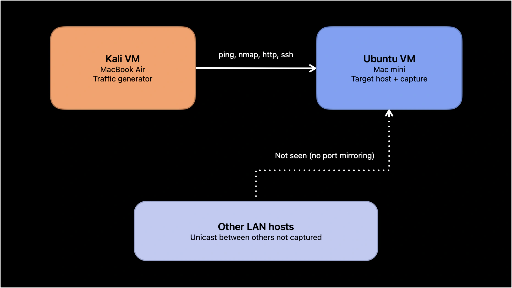
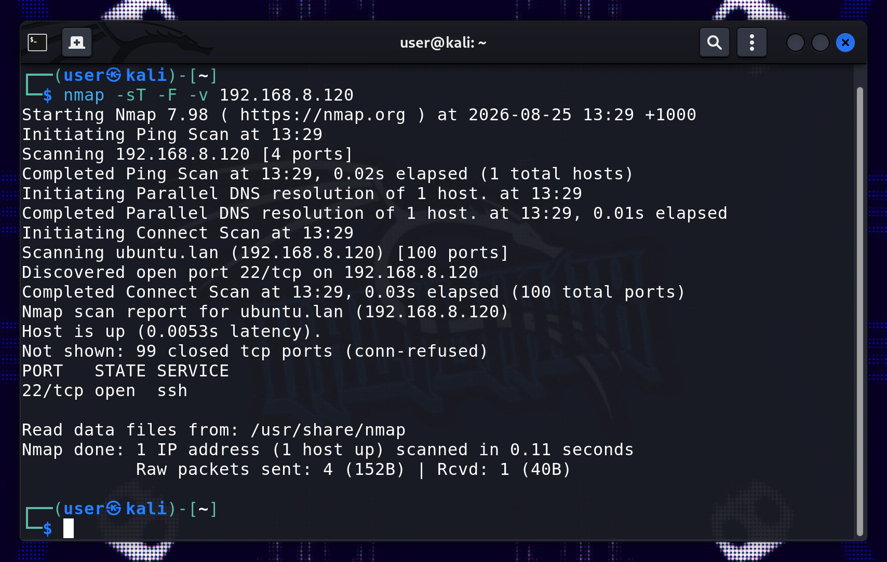
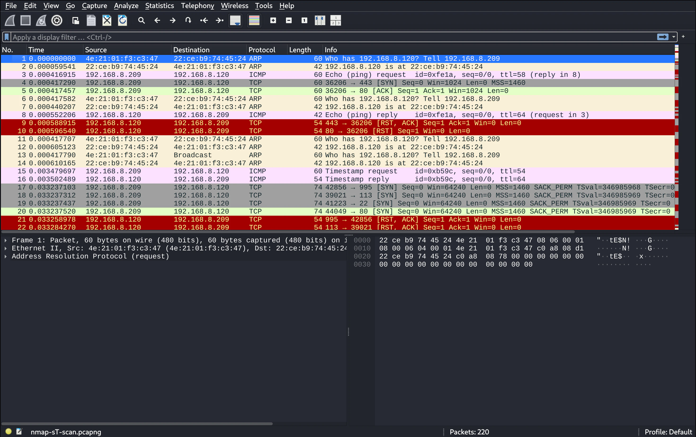
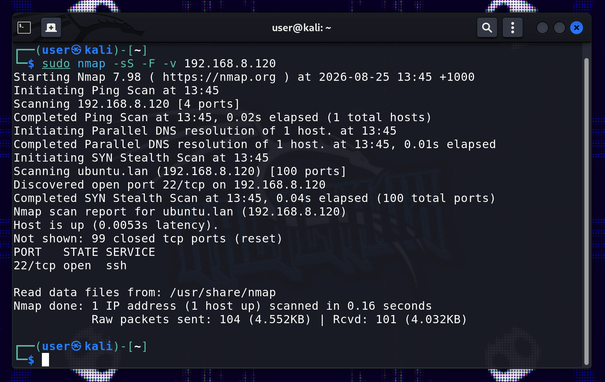
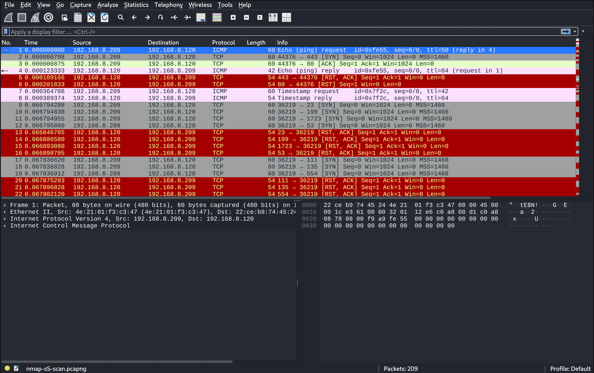
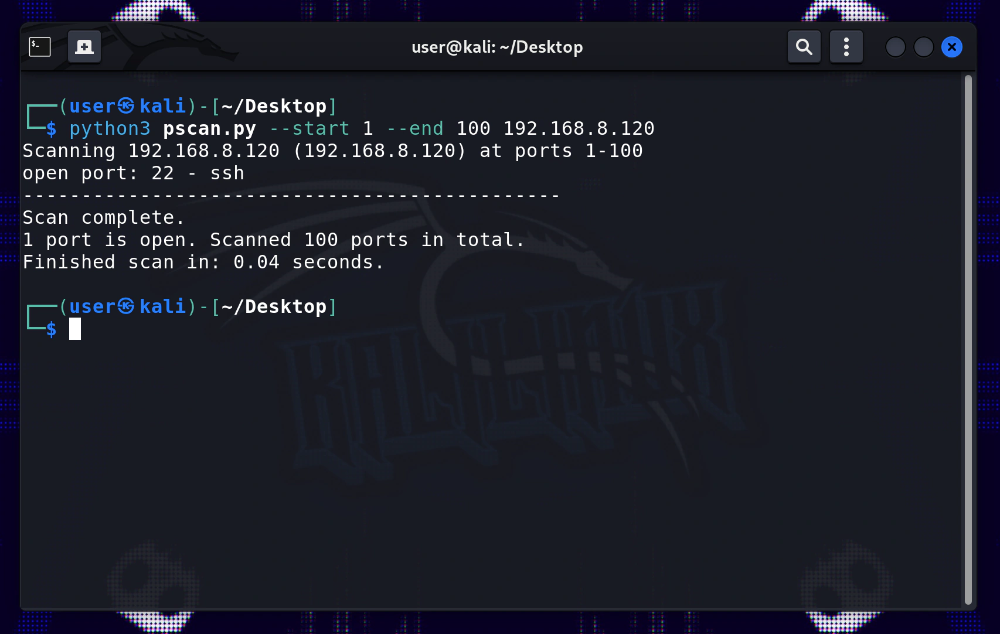
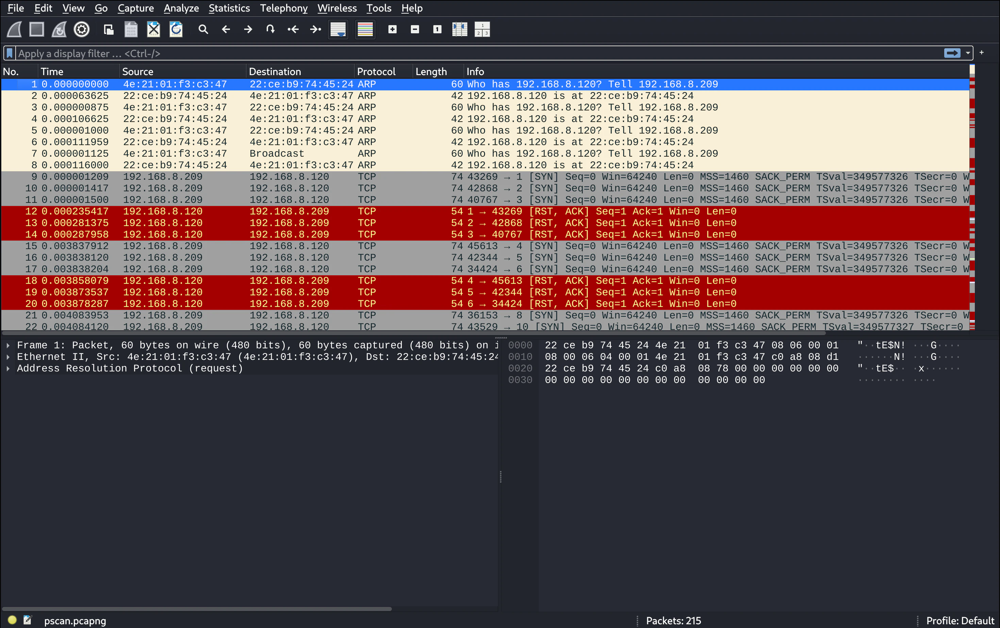

## Recapping the last entry

In the previous entry in this series on Wireshark packet capture and analysis, I went over some of the fundamentals of using Wireshark including: the pre- and post-capture screens; filtering packets before and after the capture; and the packet list, packet details, and packet bytes panels. All of this was done in the context of a unicast Kali VM host to Ubuntu VM host setup on my homelab network — capturing a series of simple ICMP ping requests and responses.

## Overview

### The aims of this entry

In this log entry, I'll be using the exact same Kali VM host to Ubuntu VM host network setup, but this time with a more interesting type of network traffic to capture, an Nmap scan capture.

The plan here is to use the Kali VM to do an Nmap port scan of the Ubuntu VM, and to capture and analyse the types of packets that get captured during this scan.

When using Nmap, there are several different modes and types of scans that can be done and captured, including host discovery scans, and OS detection. For this entry I'll be doing 2 types of scans: a TCP connect scan, and a SYN stealth / half-open scan, both of which are port scans, often used for reconnaissance or defensive hardening.

As a little addition, I'll also do a scan using the basic [Python port scanner](/projects/pscan-multi-threaded-port-scanner/) I made in one of my other projects on here. I'm curious to see what differences if any this might have to Nmaps TCP connect scan.

### VM network and addresses

As mentioned, I'll be using the same network topology setup, shown below.



And here are the Ubuntu and Kali VM IP and Mac addresses, the exact same as last entry.

```txt title=vm-addresses.txt
ubuntu vm
---------
IP: 192.168.8.120
MAC: 22:CE:B9:74:45:24

kali vm
-------
IP: 192.168.8.209
MAC: 4E:21:01:F3:C3:47
```

### Why do this?

The purpose of capturing an Nmap scan is to gain an appreciation for what a scan looks like at the protocol level. Becoming familiar with this will help with identifying attack patterns when using Wireshark in the future.
Capturing this type of network traffic, is also a good excuse to go over some of the fundamentals of the TCP/IP connection mechanics, including the famous 3-way handshake, and looking at how the SYN stealth scan transgresses against this handshake.

### The order of operations

So from here, I'll go through each scan one by one. First, starting the capture in Wireshark on the Ubuntu VM, then, executing the scan command on the Kali VM (directed at the Ubuntu IP address), and finally, finishing the capture on Ubuntu, saving the capture file for analysis.

We'll start with the TCP connect -sT scan, followed by the SYN stealth -sS scan, and then briefly touch on the basic Python scanner (pscan). 

In this writeup, I'll first scan and capture each scan type, and once I've got all captures, I'll do a comparative analysis.

## The TCP connect scan and capture

The TCP connect scan in Nmap can be performed like this:

```
nmap -sT 192.168.8.120
```

This type of scan uses the classic `connect()` function used by the OS network protocol stack. `connect()` is a system call that attempts to make a connection to a remote server via a local client socket (IP address, port number, and transport layer protocol).

The -sT scan in Nmap will use this connection method, to attempt a connection to all the sockets specified in the command (the range of port numbers combined with the target IP address).

Since -sT will use the core system `connect()` function with the Transmission Control Protocol (TCP), each connection will attempt the full 'TCP/IP 3 way handshake'. The TCP handshake consists of the following TCP control flags:

```terminal title=tcp-3-way-handshake.txt

> SYN         (client > server)   SYN = synchronize. 
# Client offers their initial sequence number for synchronization.

> SYN, ACK    (server > client)   SYN = synchronize, ACK = acknowledge.
# Server acknowledges the clients initial sequence number, and returns its own.

> ACK         (client > server)   ACK = acknowledge.
# Client acknowledges the servers initial sequence number.

**The connection is now established**

```

### Running the Nmap -sT scan

So now that we know what this scan should be doing, I'll run the Nmap command as follows:

```
nmap -sT -F -V 192.168.8.120

# [-sT] sets the scan type to TCP connect scan
# [-F] sets the scan to fast mode (scans the 100 most commonly used ports)
# [-V] makes the scan verbose
# [192.168.8.120] this is the target IP address to be scanned
```

In this command the `-F` and `-V` flags are optional, only the scan type and target IP are required. I just used the `-F` flag to keep the capture a bit more digestible and short.




In the Nmap scan output screenshot shown above, we can see that we have successfully scanned the target IP of the Ubuntu VM. From the readout above we see that 100 ports were scanned on the target IP `192.168.8.120`, and of those 100 ports, 1 open port was found: port 22 (ssh). We can expect to see this in the packet capture.

### The Nmap -sT scan capture



As discussed earlier, before executing the scan I started the capture in Wireshark on the Ubuntu VM, and then ended the capture shortly after the scan completed. The above capture is the result that capture result saved into a `.pcapng` file. The only alterations I made to this capture file was filtering out packets from non-relevant MAC addresses on my network using `!(eth.addr == xx:xx:xx:xx:xx:xx)`, and non-relevant traffic types with `not udp` or `not mdns` for example. Filters can be chained together using `&&` or `and`, you can use a negation filter with `!` or `not`.

## The SYN stealth scan and capture

Let's now move on to the next scan type. The SYN stealth / half-open scan in Nmap can be performed like this:

```
sudo nmap -sS 192.168.8.120
```

The first difference to note with this scan type compared to the last is that it requires privileged access to run properly, it needs `sudo` or a root/admin login. This is because with `-sS`, Nmap requires raw-socket privileges to craft its own packets, rather than using the built-in `connect()` system call.

Why does `-sS` craft its own packets? The aim of this scan mode is to not complete the 3-way handshake as was seen with the TCP connect scan. There could be a couple of reasons for choosing this mode: 

1. The scan is faster since it doesn't need to complete the connection.
2. The scan can avoid application layer logging, since the connection is never 'established'.

:::note
The 'stealth' name is apparently legacy now. With advancements in IDS/firewall detection techniques, SYN scans can be detected when these defences are monitoring for SYN flood style traffic (incomplete connections).
:::

We can see the expected mechanism of the -sS scan here:

```terminal title=-sS-incomplete-handshake.txt

> SYN         (client > server)   SYN = synchronize. 
# Client offers their initial sequence number for synchronization.

> SYN, ACK    (server > client)   SYN = synchronize, ACK = acknowledge.
# Server acknowledges the clients initial sequence number, and returns its own.

> RST         (client > server)   RST = reset.
# Client abruptly tears down the connection with RST instead of final ACK.

**Connection not established**

```

### Running the Nmap -sS scan

Now that we have an understanding of the basic TCP mechanism of the -sS scan, I'll execute the scan as follows:

```
sudo nmap -sS -F -V 192.168.8.120

# [sudo nmap] privileged access is required to run nmap -sS
# [-sS] sets the scan type to TCP connect scan
# [-F] sets the scan to fast mode (scans the 100 most commonly used ports)
# [-V] makes the scan verbose
# [192.168.8.120] this is the target IP address to be scanned
```



Looking at the Nmap -sS scan output above, it looks similar to the precious -sT scan except for it initiating a SYN stealth scan instead of a TCP connect scan. The scan includes a ping scan first, followed by a parallel DNS resolution, and then the main SYN scan, where it discovers an open port at port 22 (ssh).

### The Nmap -sS scan capture



I used a scan, capture, and filter flow just like the TCP connect scan. Here we can see the `.pcapng` file of the captured -sS scan.


## The pscan scan and capture

Moving on to the final scan type, this time it's a scan coming from [pscan](/projects/pscan-multi-threaded-port-scanner/), the simple port scanner I made with Python in a previous project.

My guess is that the packets captured in this scan should be quite similar to Nmap's TCP connect scan, this is because my scanner also makes a `connect()` system call, it implements this with the Python socket module.
However, I am sure there will be some differences with how Nmap handles the connection before and after.

### Running the scan with pscan

The pscan can be run as follows:

```
python3 pscan.py --start 1 --end 100 192.168.8.120

# [python3 pscan.py] since this isn't an installed tool like Nmap, we just run it as a Python script
# [--start 1] this sets the start of the port scan range to 1
# [--end 100] this sets the end of the port scan range to 100
# [192.168.8.120] this is the target IP address to be scanned
```

I decided to set the scan range from 1-100, so it matches the scans I've already done with Nmap.



Here we can see the output from pscan, the output is more simple than the optionally verbose output from Nmap, but the overall result is similar: 100 ports scanned on the target IP, one open port discovered on port 22 (ssh).

### The scan capture from pscan



And just like the previous two scan captures, here we can see the `.pcapng` of the pscan capture, with the same post-capture filters applied and saved to the capture file.

## Closing thoughts and the next part

That wraps up running and capturing all three scan types: the Nmap -sT and -sS scans, and the pscan capture. All three `.pcapng` files are captured and ready for analysis.

In the next log entry, I'll go through each capture: comparing the open vs closed port conversations packet-by-packet, I'll also delve into a couple of strange things that turned up in the pscan capture, including why its open-port conversation ended up twice as long as the Nmap -sT version, with an unexpected SSH banner and two `[RST]` packets where I expected a clean 4-way closing handshake.
