## A summary of last entry

In the last entry, I ran three port scans against the same Ubuntu VM target: Nmap's -sT TCP connect scan, Nmap's -sS SYN stealth scan, and a scan from pscan, the basic Python port scanner I built in an earlier project. While executing each scan, I captured each with Wireshark into their own filtered `.pcapng` file.

## Capture analysis

With these three capture files now ready for analysis, in this log entry we will now analyse the relevant parts of each capture, before doing a comparative analysis focussing on the differences and similarities in: 

- the overall captured packet list
- an open port TCP conversation
- a closed port TCP conversation
- the packet details of interesting packets

## Nmap -sT capture analysis

### -sT packet list overview

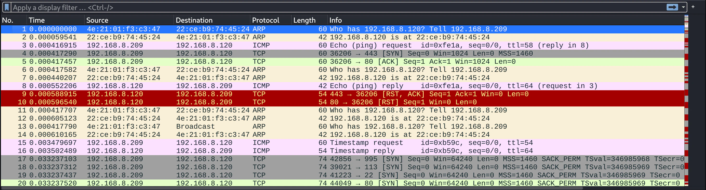

Looking at the `.pcapng` file for the -sT scan here, we can immediately see the packet list panel up top. There are a number of packets and frames sent at the initiation of the scan, we can see some ARP, ICMP and TCP packets. 

Recall from the scan output earlier (in the last entry), that Nmap first does a ping scan before conducting the full -sT scan? This is what we are seeing over the course of the first 16 packets. This is mainly to test if the target host is even up and reachable. If the target host is not reachable, there is no point trying to scan potentially thousands of ports on a target that cannot be reached, that would be a waste. Therefore, Nmap does a quick ping scan and ARP resolution, to check the host is up, if it is, it will continue the scan.

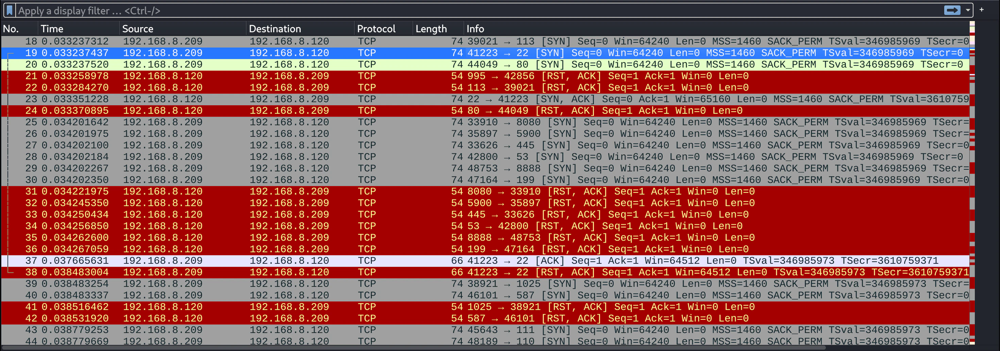

The screenshot above shows a portion of the capture file, much of the capture file looks like this. Since 99/100 ports that were scanned are closed, most will have the same pattern: SYN packet from Kali > Ubuntu to attempt a socket connection, and RST, ACK from Ubuntu > Kali to effectively confirm a closed port and drop the connection. I'll show a specific example of this a little further down.

This screenshot also covers the packets involved in the connection to the only open port: port 22 (ssh). We'll look at this packet conversation a little closer in a moment.

### Following the packet stream

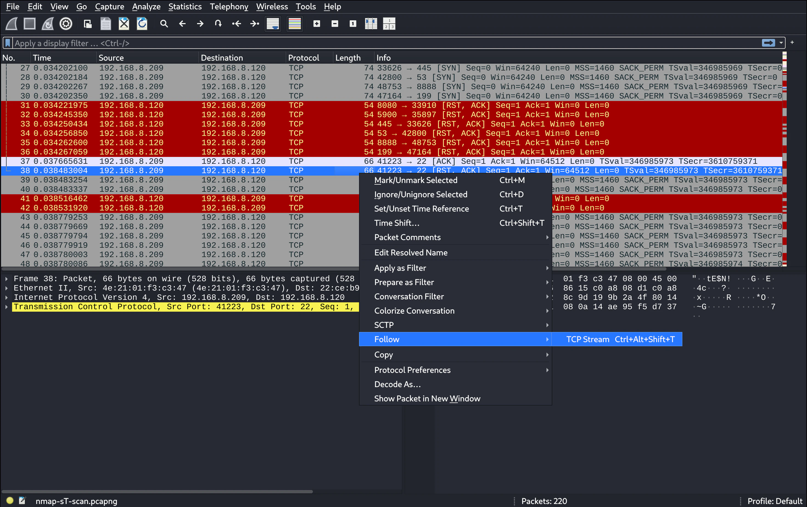

In Wireshark, there is a convenient way to isolate packets related to a single back and forth conversation between two hosts connecting on the network. In the above screenshot we can see one way to do this. Because I want to take a closer look at the TCP conversation involving the open port 22, I can choose to follow the TCP stream to automatically set a filter that isolates this conversation. Right-clicking on one of the involved packets (or going to 'Analyze' in the menu bar), we can select 'Follow > TCP Stream'.

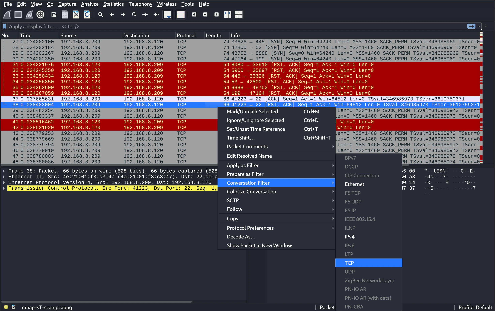

This screenshot is another method that has a like effect. We can right-click on one of the packets in the conversation and select 'Conversation Filter > TCP'.

Either of these two options will apply the `tcp.stream eq x` filter (with the relevant TCP stream conversation number substituted for `x`), and lead to the result shown in the next two screenshots.

### -sT conversation completeness

So here we are getting to the main substance of this homelab. In the following two screenshots we can see the TCP conversation isolated for an open port (port 22) in the first image, and a closed port (port 80), in the second image.

**TCP stream / conversation, open port 22**
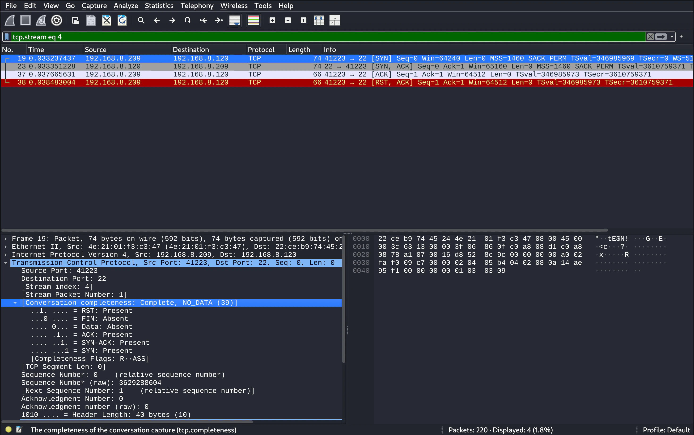

In the screenshot above we can see the isolated TCP conversation involving the scan of port 22. The TCP flags match up with what we talked about earlier which is nice to see. There are four packets shown in this conversation: `[SYN], [SYN, ACK], [ACK], [RST, ACK]`. 

The TCP 3-way handshake is shown in its completed form here with `[SYN], [SYN, ACK], [ACK]`. If we observe the source and destination IP addresses of each packet in the conversation, we can see that the Kali VM IP `192.168.8.209` is sending a `[SYN]` TCP packet to the Ubuntu VM IP `192.168.8.120` as its destination address. The unfolding of the back and forth pattern between these addresses can be seen with the remaining TCP packets and respective flags in this conversation. 

We can also note that it says 'complete' in the packet details panel under 'conversation completeness'. Interestingly, under this same packet details section, it shows that all TCP flags are present except for the Data and FIN flags.

The fourth packet in this conversation `[RST, ACK]`, is not part of the 3-way handshake, but is instead the connection teardown/termination. Nmap uses the abrupt `[RST, ACK]` shown here.

**TCP stream / conversation, closed port 80**

In this screenshot, we see an example of a TCP conversation for the scan of a closed port. There are 99 conversations with the same pattern as this is the main scan, I chose to select port 80 as an example for this writeup.

The pattern is shorter here, it consists of only `[SYN]` and `[RST, ACK]`. The Kali VM IP `192.168.8.209` sends a `[SYN]` TCP packet to the Ubuntu VM IP `192.168.8.120` as its destination address (just as before), but this time the Ubuntu VM sends back `[RST, ACK]`. This is because the port is closed, and no connection can be established, resulting in the termination of the socket connection.

If we look to the packet details section we can see that 'the conversation completeness' section reads as 'incomplete', with most TCP flags absent.

## Nmap -sS capture analysis

### -sS packet list overview

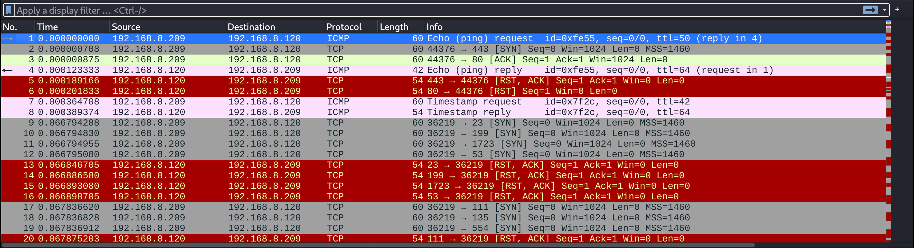

Moving on to the -sS SYN scan `.pcapng` file now, we can see a similar initial packet list panel to the -sT scan. Like that capture, the Nmap -sS scan starts with an ICMP ping scan to test the connection and for host discovery, including an initial scan of port 80 and 443 (this is done as a verification failsafe in case a firewall were to filter ICMP packets, as some often do).

It's also worth noting the absence of any ARP packets here compared to the -sT scan. This is likely because or ARP caching, since I ran the -sS scan almost immediately after the -sT scan (which did produce ARP packets), it is most likely because the ARP table already had the addresses it needed for this connection cached.

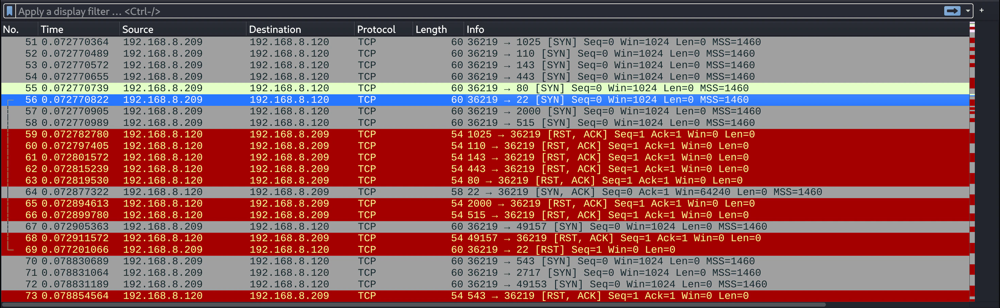

This 2nd screenshot shows a portion of the capture a bit further down the list, and like before it covers some of the packets involved in the open port 22 TCP conversation. If we look closely we can notice some differences, specifically some missing parts of the TCP conversation for the scan of port 22, but we'll go over it in the next screenshot where it's a bit clearer.

From here, like before, we can right-click on one of the port 22 packets to either follow the TCP stream, or apply the conversation filter.

### -sS conversation completeness

**TCP stream / conversation, open port 22**
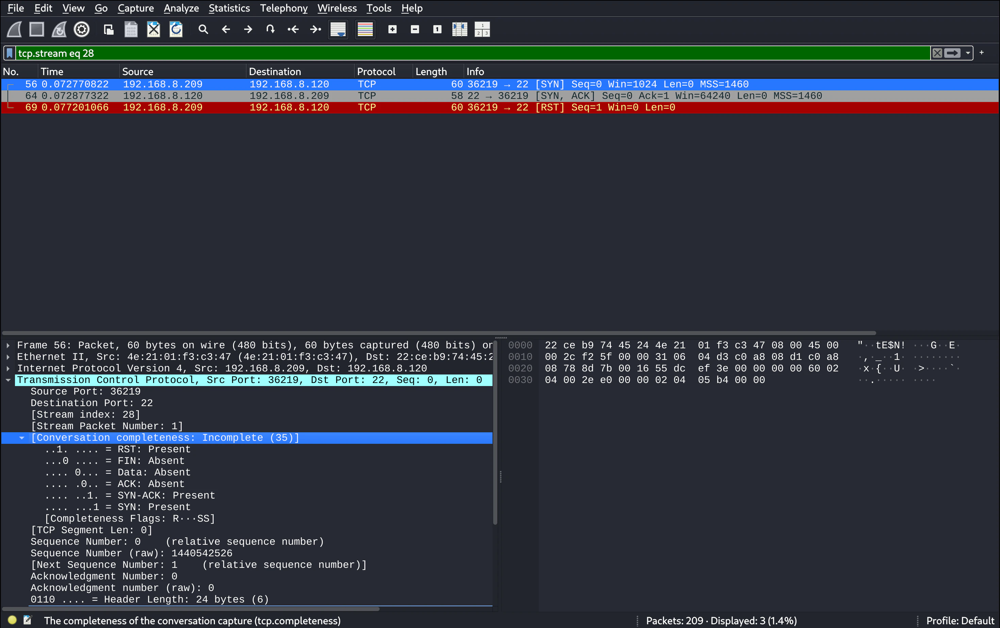

After applying the filter for the TCP stream involving port 22, we end up with the screenshot shown above. This is the exact same situation as before (with the -sT scan), but now with the -sS scan capture.

Remember when we discussed the SYN stealth / half-open scan earlier (in the previous entry), and how it intentionally doesn't complete the 3-way handshake? This screenshot shows that clearly. There are three packets in this TCP conversation: `[SYN], [SYN, ACK], [RST]`. Kali sends a `[SYN]` packet, Ubuntu responds with a `[SYN, ACK]` packet, but here instead of replying with `[ACK]` like normal, Kali instead responds with `[RST]`, abruptly and preemptively tearing down the socket connection before a proper connection can be established.

If we look to the packet details panel, we will see that the 'conversation completeness' is detailed as 'incomplete', even though Nmap has successfully determined the port to be open. We can also notice that most of the TCP flags are absent in the completeness map.

**TCP stream / conversation, closed port 80**
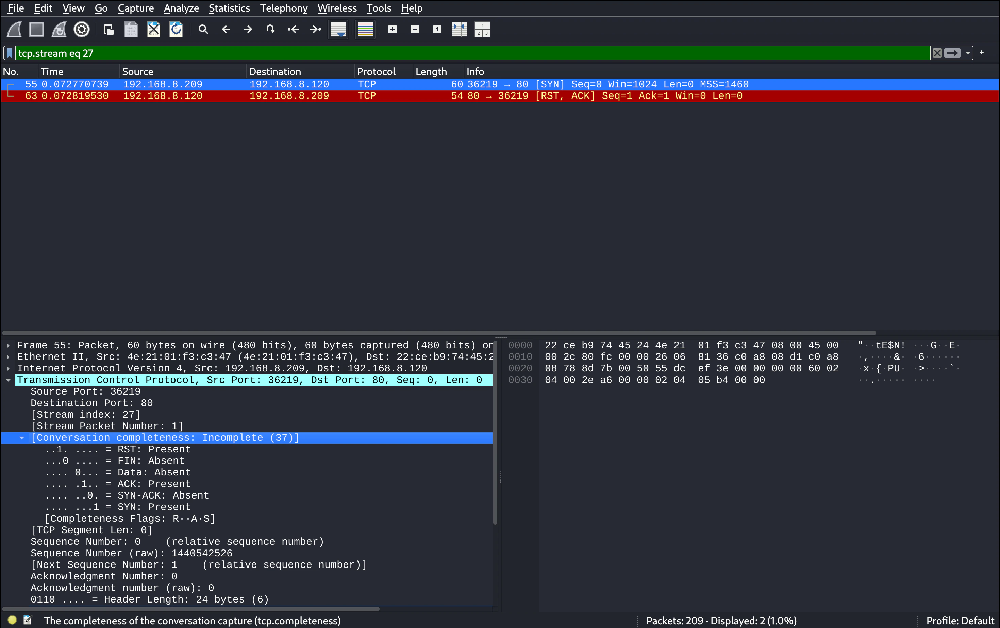

Now lets look at the closed port 80 conversation as before, but now with the -sS scan capture. With the level of detail we've been looking at so far, there appear to be no significant differences between the closed port conversation of the -sT and -sS Nmap scans. -sS also consists only of the `[SYN]` and `[RST, ACK]` TCP packets.

## pscan capture analysis

### pscan packet list overview

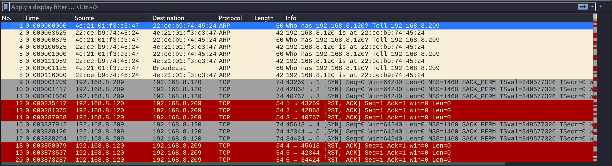

Now let's move on to the final scan type I did, the scan from pscan. There is actually quite a bit of a difference already in this initial packet list panel screenshot shown above. 

First, there are a few repeated ARP requests and replies in a row before the first SYN TCP packet. After looking this up, this seems to be a result of the way multi-threading is used in pscan. With Nmap, an initial 'host discovery' phase is carried out, likely *without* multi-threading, once the host availability has been confirmed, the scan phase begins, which *would* involve multi-threading. In pscan, there is only the one main phase (which uses multi-threading), and no host discovery or validation. Multiple threads trigger the ARP packets to be sent simultaneously, resulting in duplicate ARP packets.

Another thing to notice is that there is no ICMP ping scan, as mentioned above, this is due to the lack of a host discovery phase.

And thirdly, we can see that the scanning progresses in a sequential order (when you factor for multi-thread time differences). This is in contrast to the Nmap scans, which appeared to be random or use some other non-sequential algorithm (though I know scanning sequentially is an option in Nmap).

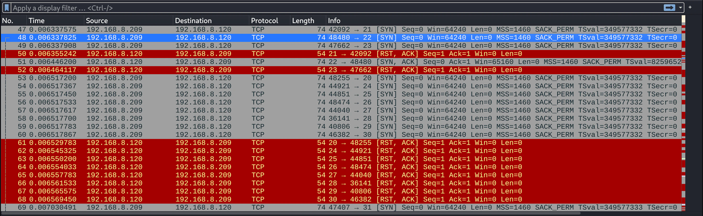

Observing this 2nd screenshot from a further down portion of the capture, we can see a similar sequential scan pattern occurring. We can also see part of the open port 22 scan TCP conversation, and all the other closed port scans receiving red `[RST, ACK]` packets from the Ubuntu VM IP in return to the Kali VM IP `[SYN]` packets.

### pscan conversation completeness

**TCP stream / conversation, open port 22**
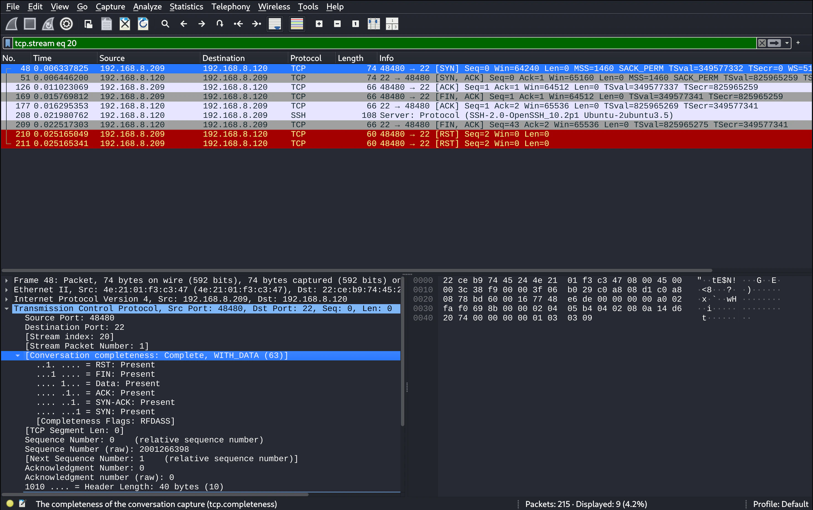

After once again applying the TCP stream conversation filter to the open port 22 TCP conversation, we can see the isolated packets from that conversation shown in the screenshot above.

Interestingly, the open port conversation with pscan is the longest conversation. And looking to the packet details panel under 'conversation completeness' we not only see the conversation marked as 'complete', but every TCP flag is present. 

The reason for this can be explained due to the following: the pscan scanner I built uses Python's `with` statements to gracefully close each socket connection with each thread, rather than tear down the connection forcefully. This *should* result in each open socket scan finishing and closing the conversation with the more formal 4-way closing handshake: `[FIN, ACK], [ACK], [FIN, ACK], [ACK]`, but instead we got a longer sequence with 2 RST packets at the end: `[FIN, ACK], [ACK], [FIN, ACK], [RST], [RST]`. Also, there is an SSH protocol banner message before the 2nd `[FIN, ACK]`. 

After researching, it appears that this SSH banner message is the reason for the not so smooth closing handshake (when an RST flag is involved the connection has aborted abruptly). Apparently SSH is a 'server speaks first' protocol, so as soon as the connection was established, SSH pushes its ID banner onto the wire, and it gets received into the receiving hosts kernel buffer (this is why the conversation completeness notes 'WITH_DATA'). Since pscan doesn't handle this data with `recv()`, and the data is sitting in the buffer, the OS can't gracefully close the connection with data still in the buffer, so it responds by using `[RST]` to halt the connection.

Why two `[RST]` packets? This I'm not so sure about, but it seems to be a result of both the OS and the SSH server connection trying to halt the connection independently. I suppose this is a good demonstration for why Nmap might be opting to take control and force the connection closed itself with `[RST, ACK]`, not only does it make it faster, but it avoids strange and messy cases like this.

**TCP stream / conversation, closed port 80**
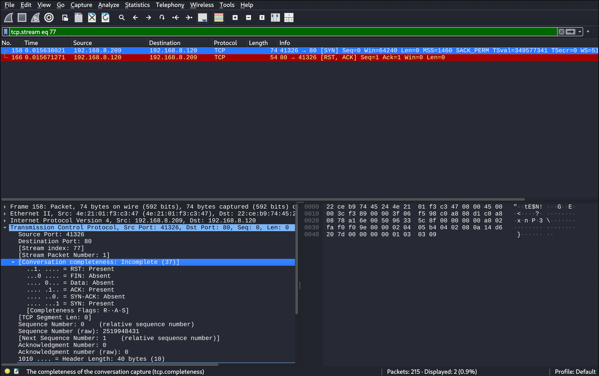

The screenshot above shows the TCP conversation for closed port 80 from the pscan capture. Comparing this with the previous two scan types, we can see that the closed port connection interaction here is essentially the same.

## Comparative analysis

Finally, here is a clearer visual comparison of all three scan types we've done so far, for both the open and closed port TCP stream conversations we looked at.

### Open port TCP stream conversations

The Nmap -sT and -sS scans are somewhat similar, the -sT TCP connect scan has the following packets: `[SYN], [SYN, ACK], [ACK], [RST, ACK]`, completing the TCP 3-way handshake. The -sS stealth has the same first two packets: `[SYN] and [SYN, ACK]`, and then only a third packet: `[RST]`, which doesn't complete the TCP 3-way handshake, and instead tears down the socket connection abruptly, without even acknowledging the `[SYN, ACK]` preceding it.

The pscan conversation on the other hand, starts with the same 3-way TCP handshake as the -sT TCP connect scan, but instead of tearing down the connection with: `[RST, ACK]`, it attempts to do a formal 4-way closing handshake with: `[FIN, ACK], [ACK], [FIN, ACK], [ACK]`, but instead ends with a messier: `[FIN, ACK], [ACK], [FIN, ACK], [RST], [RST]`. As mentioned above in more detail, this happened due to the limitations of the program, and uncleared data in the kernel buffer before closing the connection.

**Nmap -sT TCP stream open port 22**
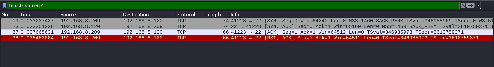

**Nmap -sS TCP stream open port 22**
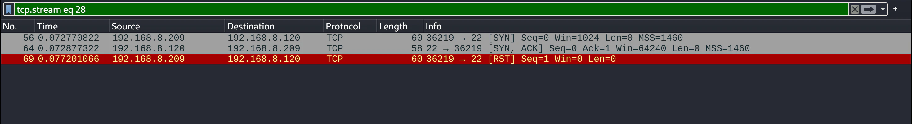

**pscan TCP stream open port 22**
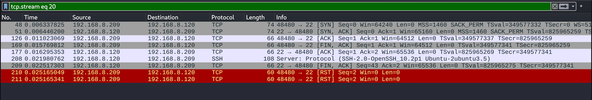

### Closed port TCP stream conversations

As previously discussed, the closed port TCP conversations are essentially the same between these three scan types. All feature a `[SYN]` TCP packet from Kali VM > Ubuntu VM, and a `[RST, ACK]` TCP packet from Ubuntu VM > Kali VM.

**Nmap -sT TCP stream closed port 80**
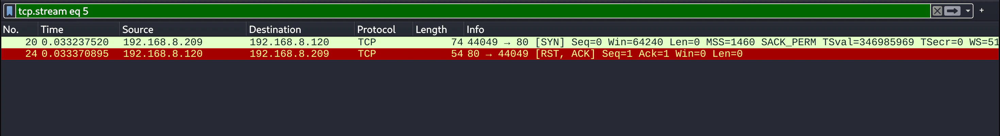

**Nmap -sS TCP stream closed port 80**
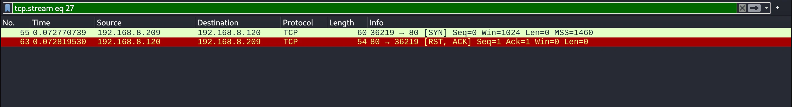

**pscan TCP stream closed port 80**
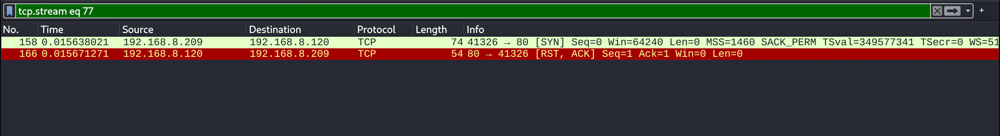

## Tying it all together

In these two entries on Nmap capture and anlaysis we've covered:

- How to use two different types of Nmap scans: -sT and -sS (including some optional flags)
- An overview of the TCP 3-way handshake, how -sS doesn't complete it whereas -sT does
- Comparisons with pscan, a simple Python port scanner built in a previous project
- Capturing each scan into a filtered `.pcapng` capture file
- Analysis and comparison of the packet list
- How to isolate a TCP stream conversation
- Analysis and comparison of an open port TCP conversation
- Analysis and comparison of a closed port TCP conversation

These past two entries on Nmap scan capture and analysis have been good for me to get more familiar with: Nmap scanning, packet capture across a multi-VM network, comparative Wireshark analysis across multiple capture files, and particularly — TCP conversation flags.

That wraps up this entry, thanks for reading! I hope you'll join me in the next one.