## Generating http / tcp traffic

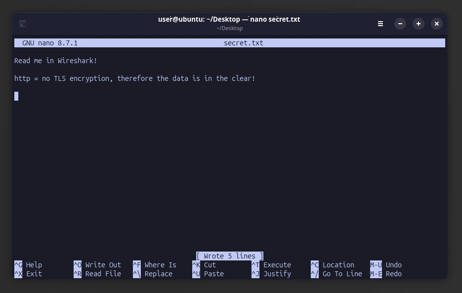

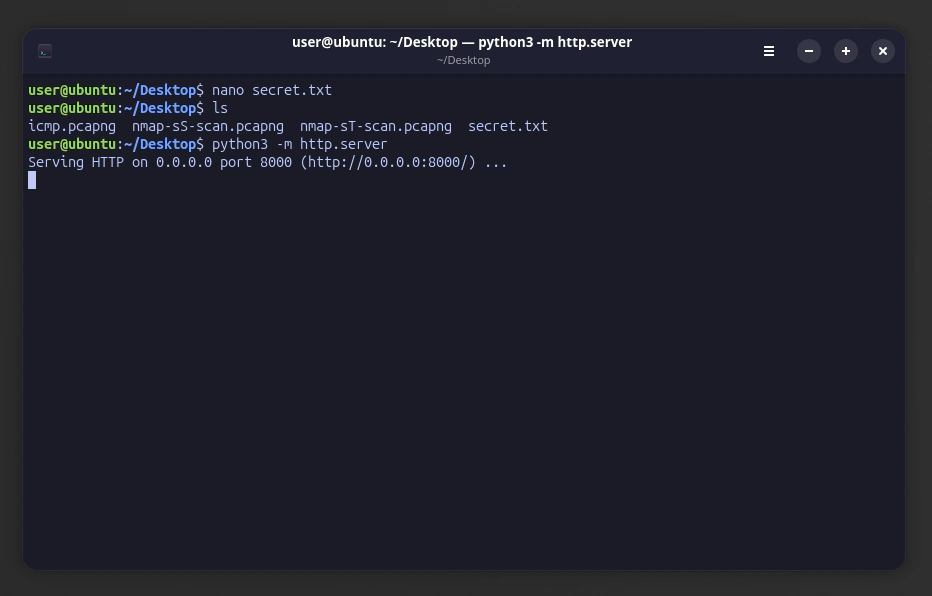

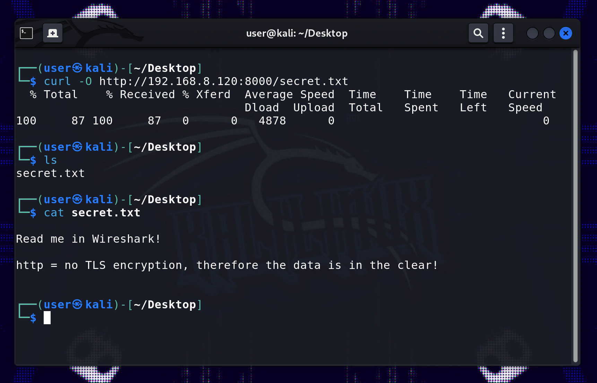

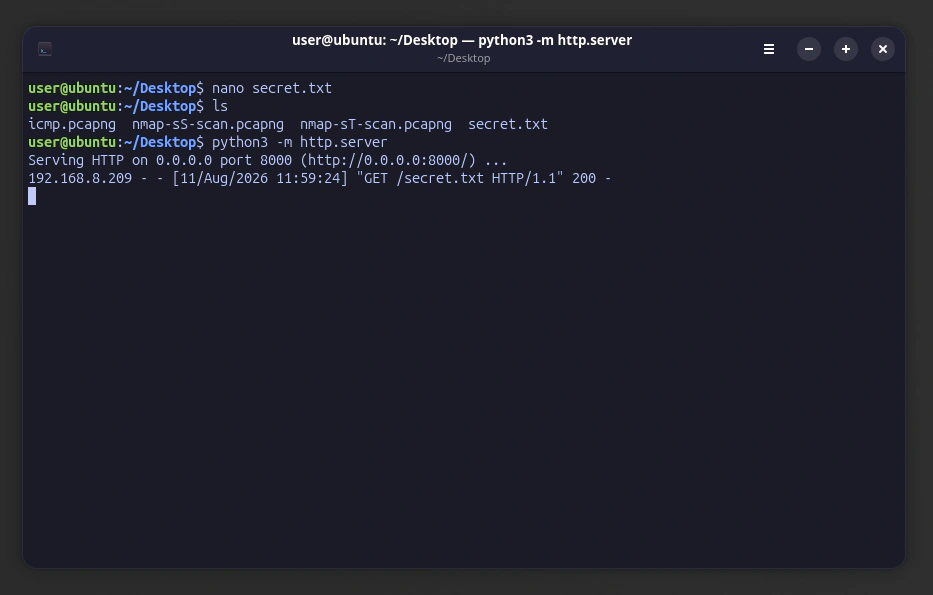

## Capture and analysis of http / tcp traffic

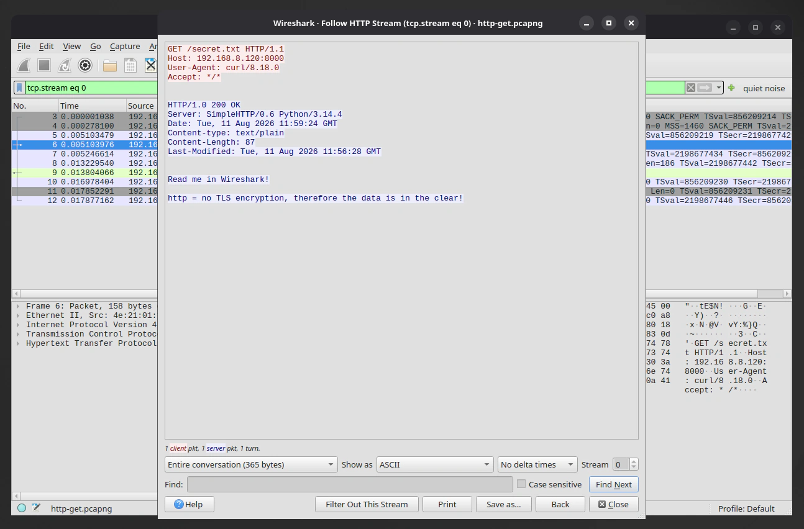

## Generating ssh and scp traffic

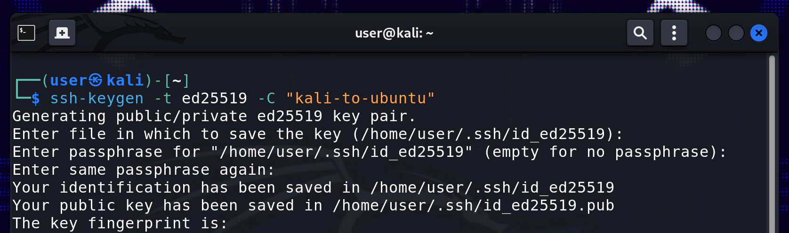

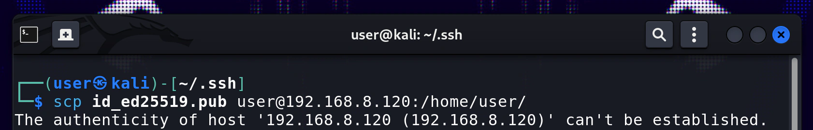

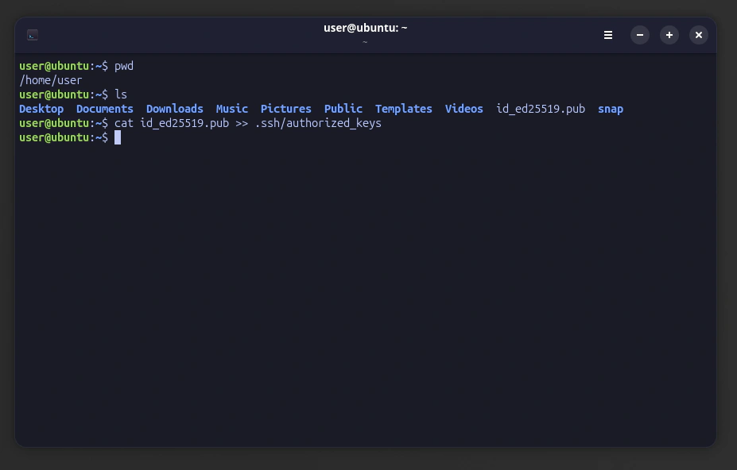

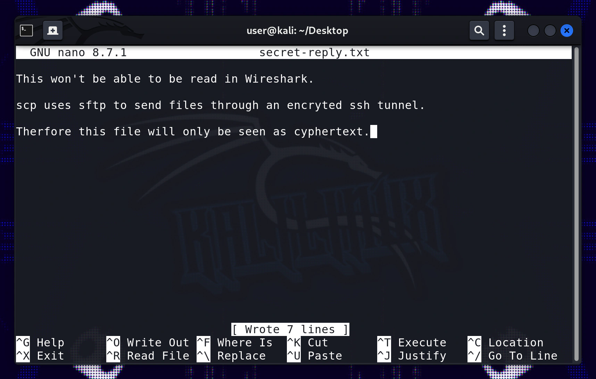

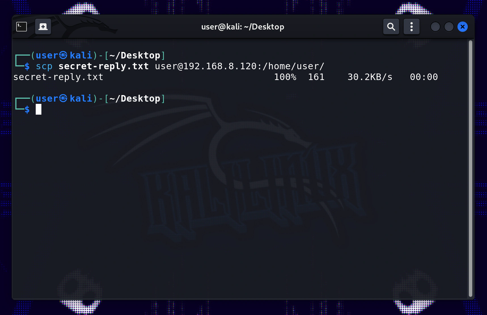

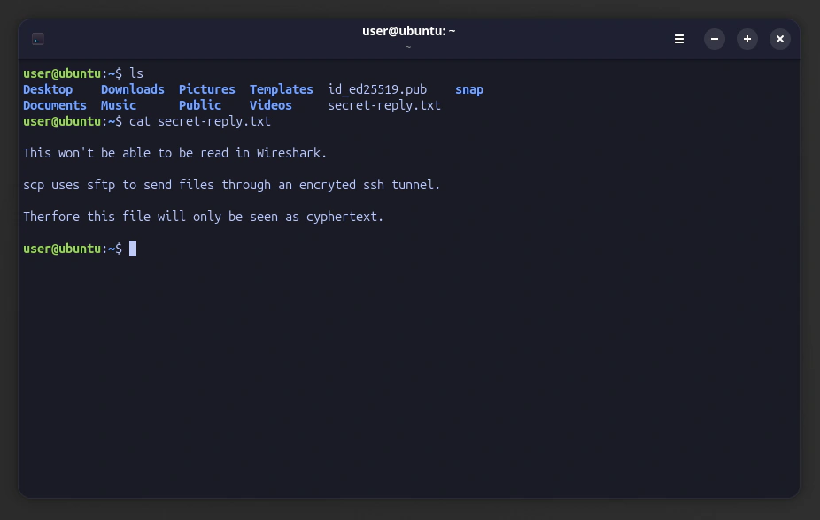

## Capture and analysis of ssh and scp traffic

## What I learned